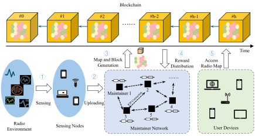
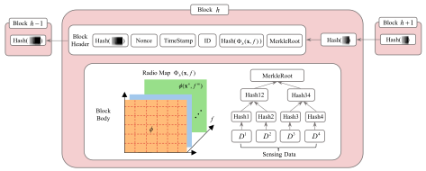

# Decentralized-Trustworthy-Radio-Map

ChainXim-based simulation of Decentralized Trustworthy Radio Map

Source code for the simulations in the paper "Decentralized Trustworthy Radio Map:A Blockchain Approach". This project is built upon a previous version of [ChainXim](https://github.com/XinLab-SEU/ChainXim).

## Introduction

Radio maps, which spatially and temporally characterize radio signal strength and spectrum occupancy, are vital for efficient spectrum management and network optimization in modern wireless communication systems.

Schematic diagram of the blockchain-based radio map is shown as follows. The workflow of the proposed framework includes the following stages: (1) sensing nodes (operator-deployed and mobile devices) sense the spectrum environment; 
(2) sensing nodes upload the data; (3) blockchain maintainers aggregate data via blockchain; (4) blockchain updates the radio map with new blocks and distribute rewards; and (5) users access real-time radio map.



This framework modifies the data structure of blocks to meet the construction requirements of wireless maps. Block structure in the blockchain-based radio map is as follows. 
The structure includes the modified block header storing the radio map hash for verification and the block body containing the radio map and sensing data in a merkle tree.



## Quick Start
### Download

You can clone the Github repository with git.

Git clone command: `git clone https://github.com/Erling-Shelby/Decentralized-Trustworthy-Radio-Map.git`

Or you can download the master branch from the code repository: [master.zip](https://github.com/BCRM2025/Decentralized-Trustworthy-Radio-Map/archive/refs/heads/master.zip)

### Environment Setup
1. Install Anaconda. [Anaconda download link](https://www.anaconda.com/download)
2. Open Anaconda Prompt from the Start menu.
3. Create a conda environment and activate it, choosing Python version 3.10.
```
conda create -n RadioMap python=3.10 python-graphviz
activate RadioMap
```
4. Install the required packages via pip.
```
cd <project_directory>
pip install -r requirements.txt
```

### Datasets

Our dataset is located in `npz/`. You can also use the commercial ray tracing software [Remcom Wireless Insite](https://www.remcom.com/wireless-insite-em-propagation-software) to build your own dataset.
